from django.http import HttpResponse

# WEB DEVELOPMENT COUPLE

## Hello! It's a project for WEB DEVELOPMENT COUPLE.

Just a project for education

## Laboratory work 1 (02.11.2026)
<details>
<summary>CLICK HERE TO SEE THE TASK CONDITION</summary>

> ### Задача
> Вам подвернулся подходящий случай применить полученные знания на практике. 
> Известная медицинская фирма Unicorn разработала новый монитор сердечного 
> ритма heart tracker, и вас пригласили написать программный модуль для этого устройства. 
> Заказчик составил техническое задание, которому вы должны следовать для успешного 
> выполнения проекта. Вам предстоит написать константы и функции.

> ### **Техническое задание**
> Программный модуль для обработки данных монитора сердечного ритма 
> heart tracker фирмы Unicorn.

> ### **Входные данные**
> Модуль получает от микросхемы-контроллера пакеты данных в виде кортежей.
> Пакеты передаются в программу в момент обращения к трекеру (при нажатии на кнопку). 
> Порядок значений в пакете данных:
> _**(<time>, <heart_rate>)**_
>- <time>: время создания пакета; значение типа str; формат:
>'часы:минуты:секунды'.
>- <heart_rate>: частота сердечных сокращений, измеренная пользователем 
> с момента последнего обращения; значение типа int.

> При передаче пакетов могут случаться сбои, это надо учесть в программе.
> При поступлении пакета нужно проверить его; передавать пакет на обработку можно только
> после проверки.

> ### **Возможные ошибки при получении пакетов:**
> 1. Пакет меньшей или большей длины.
> 2. У одного или нескольких параметров в пакете пустое значение.
> 3. Значение времени в переданном пакете меньше или равно предыдущему записанному значению 
> (время считается в рамках одних суток).

> ### **Результат выполнения программы**
> 1. Полученные пакеты должны сохраняться в словаре storage_data. 
> Ключами для него будут значения времени, а значениями — частота сердечных сокращений.
> 2. В терминал должно выводиться сообщение, например такое (в начале и в конце сообщения должна выводиться пустая строка):
     ```
     _Время_: 09:36:02.
     _Частота сердечных сокращений за сегодня_: 72 уд/мин.
     'Хороший результат, Вы движетесь в правильном направлении!'
     ```
> 3. Также должно выводиться мотивирующее сообщение. Его содержание должно зависеть от интенсивности сердечного ритма:
    > ```
    >     - 100 уд/мин и более: 'Осторожно что-то не так! Обратитесь к врачу.'
    >     
    >     - 80 уд/мин и более: 'Осторожно успокойтесь!'
    >     
    >     - 60 уд/мин и более: 'Хороший результат, Вы движетесь в правильном направлении!'
    > 
    >     - Менее 60 уд/мин: 'Главное — быть активным!'
    > ```
> 4. Программа должна возвращать словарь storage_data, чтобы можно было продолжить обработку данных в других программах.

> ### **Точка входа в программу**
> - Функция обработки пакетов _accept_package()_ — это точка входа в программу, функция, которая вызывается первой. На вход она принимает пакет с данными. 
> - Функция _accept_package()_ должна вернуть словарь storage_data, в который добавлены данные из полученного пакета. Из этой функции по цепочке вызываются другие функции, каждая из которых отвечает за свою часть работы. 
> - Сразу после старта должна выполниться функция _check_correct_data()_, проверяющая корректность полученного пакета. Она может вернуть true или False, что повлияет на дальнейшее выполнение базовой функции.

</details>


### 1. How to create Django project

```bash
# create virtual environment called venv
python -m venv venv 

# activate virtual environment in Windows
venv\Scripts\activate 

# install django
pip install django

# create django project
django-admin start project mysite . 
# The dot indicates to create files only in the specified folder, so as not to create new ones

# create django app 
python manage.py startapp app
```
**File structure**

- _**manage.py**_ - main file for project control
- _**mysite/**_ - project settings
- _**app/**_ - application

### 2. Project registration
In mysite/settings.py
```python 
INSTALLED_APPS = [
    'django.contrib.admin',
    'django.contrib.auth',
    'django.contrib.contenttypes',
    'django.contrib.sessions',
    'django.contrib.messages',
    'django.contrib.staticfiles',
    # add application
    'app'
]
```
### 3. Start the server
If you run
```bash
python manage.py runserver
```
and navigate to the path in the terminal
(for example 'Starting development server at http://127.0.0.1:8000/')

U can see a page like this in your browser:
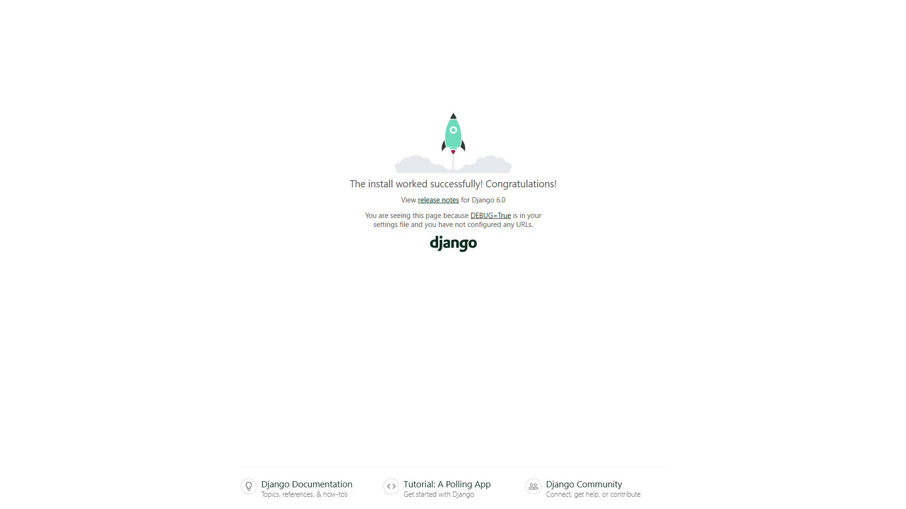

### 4. Create model
In app/models.py
```python 
class HeartRateRecord(models.Model):
    time = models.CharField(max_length=8, unique=True, verbose_name='Время записи')
    heart_rate = models.CharField(verbose_name='Частота сердечных сокращений')

    def __str__(self):
        return f'{self.time} -> {self.heart_rate} уд/мин.'
```
After the changes in app/models.py u have to create migrations for data updates
```bash
python manage.py makemigrations
python manage.py migrate
```

### 5. Create functions for interaction with database
In app/view.py
```python

# data display
def accept_package(request):
    time = request.GET.get('time')
    heart_rate = request.GET.get('rate')

    try: heart_rate = int(heart_rate)
    except(ValueError, TypeError):
        return HttpResponse(
            'Error: Incorrect heart rate recording format',
            status=400)

    if not check_correct_data(time, heart_rate):
        return HttpResponse(
            'Error: Validation or time failure',
            status=400)

    HeartRateRecord.objects.create(time=time, heart_rate=heart_rate)
    message = get_motivation_message(heart_rate)

    response_html = f"""
<div>
    <div>Время: {time}</div>
    <div>Частота сердечных сокращений: {heart_rate} уд/мин.</div>
    <div>'{message}'</div>
</div>
"""
    return HttpResponse(response_html)


# data validation 
def check_correct_data(time: str, rate: int) -> bool:
    if not time or rate is None:
        return False

    elif not (30 <= rate <= 250): # для разумных пределов
        return False
    else:
        last_val = HeartRateRecord.objects.order_by('time').last()
        if last_val and last_val.time >= time :
            return False
        return True

# message display 
def get_motivation_message(heart_rate: int) -> str:
    if heart_rate >= 100:
        return 'Осторожно что-то не так! Обратитесь к врачу.'
    elif 80 <= heart_rate < 100:
        return 'Осторожно успокойтесь!'
    elif 60 <= heart_rate < 80:
        return 'Хороший результат, Вы движетесь в правильном направлении!'
    else:
        return 'Главное — быть активным!'
```

### 6. URL Settings
In app create urls.py:
```python
from django.urls import path
from . import views

urlpatterns = [
    path('track/', views.accept_package, name='accept_package'),
]
```
And in mysite/urls.py:
```python
from django.contrib import admin
from django.urls import path, include

urlpatterns = [
    path('admin/', admin.site.urls),
    path('', include('app.urls'))
]
```
### 7. Testing
If u run server at http://127.0.0.1:8000/
```bash
python manage.py runserver
```
u can see
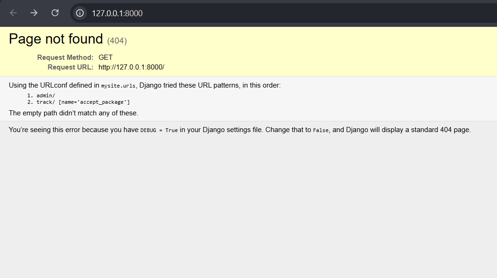

If u go to http://127.0.0.1:8000/track/
U can see message "Error: Incorrect heart rate recording format"
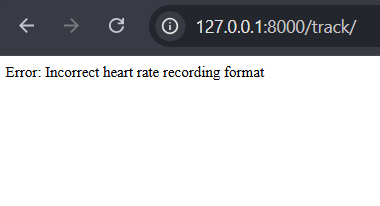

For testing you can add the time and heart rate: 
http://127.0.0.1:8000/track/?time=09:08:50&rate=80

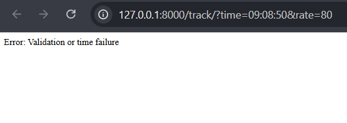

http://127.0.0.1:8000/track/?time=09:80:02&rate=72

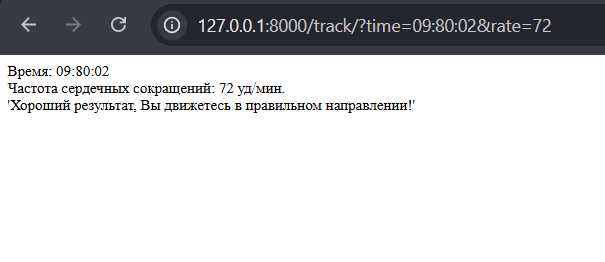

But after page updating:

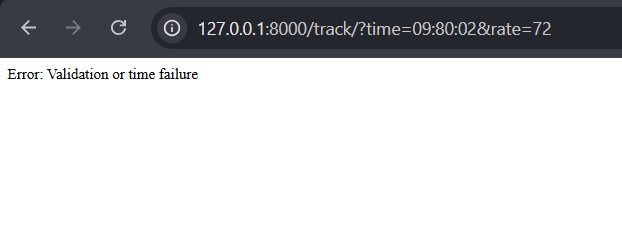

### Saved at the commit "laboratory work 1 (02.11.2026)"

## Laboratory work 2 (02.18.2026)

<details>
    <summary>CLICK HERE TO SEE THE TASK CONDITION</summary>

> **Задание для самостоятельной работы:** Разработка веб-приложения на
> Django для медицинской клиники "Здоровье+"


> **Цель задания:**
> Закрепить знания о создании и настройке веб-приложений на Django, а также
> научиться работать с моделями, представлениями и маршрутизацией.
>
> **Задание:**
> Создайте веб-приложение для медицинской клиники "Здоровье+",

> **Функции**
> 1. Создание проекта и приложения appointments
> 2. Представлени:
>   В файле views.py создайте следующие функции заглушки:
```python
from django.http import HttpResponse

def appointment_list(request):
""" Отображает список всех записей на прием. """
# Заглушка: Возвращаем текстовое сообщение
    return HttpResponse("Список всех записей на прием.")

def appointment_detail(request, appointment_id):
""" Отображает детали конкретной записи на прием. """
# Заглушка: Возвращаем текстовое сообщение с ID записи
    return HttpResponse(f"Детали записи на прием с ID: {appointment_id}.")

def create_appointment(request):
""" Форма для создания новой записи на прием. """
# Заглушка: Возвращаем текстовое сообщение
    return HttpResponse("Форма для создания новой записи на прием.")
``` 
> 3. Маршруты:
> - В файле urls.py приложения appointments настройте маршруты
для ваших представлений:
>   - Главная страница (например, /): отображает приветственное
сообщение.
>   - /appointments/: отображает список записей на прием.
>   - /appointments/<int:pk>/: отображает детали конкретной
записи.
>   - /appointments/create/: форма для создания новой записи.

</details>

### 1. Create application "appointments"

```bash
django-admin startapp appointments
```
### 2. Create features appointment_list, appointment_detail, create_appointment
In appointments/view.py
```python
def home(request):
    return HttpResponse('HELLO WORLD')
def appointment_list(request):
    return HttpResponse('List of all appointments')

def appointment_detail(request, appointment_id):
    return HttpResponse(f'Appointment details with ID: {appointment_id}')

def create_appointment(request):
    return HttpResponse('Appointment form')
```
### 3. URL settings
Create rotes in application (in appointments/urls.py):
```python
urlpatterns = [
    path('', views.home, name='home'),
    path('appointments/', views.appointment_list, name='appointment_list'),
    path('appointments/create/', views.create_appointment, name='create_appointments'),
    path('appointments/<int:appointment_id>', views.appointment_detail, name='appointment_detail')
]
```
Connecting rotes in mysite/urls.py:
```python
urlpatterns = [
    path('admin/', admin.site.urls),
    path('', include('appointments.urls'))
]
```
### 4. Testing
When we start the server in http://127.0.0.1:8000/ :

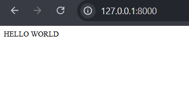

But at the http://127.0.0.1:8000/appointments :

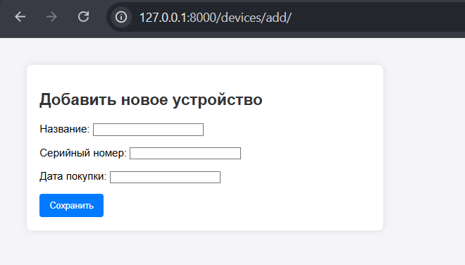

At the http://127.0.0.1:8000/appointments/8 (for example):

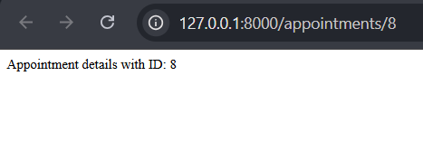

At the http://127.0.0.1:8000/appointments/create :

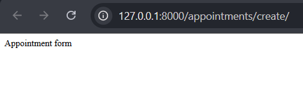

### Saved at the commit "laboratory work 2 (02.18.2026)"

## Laboratory work 3 (02.25.2026)

<details>
    <summary>CLICK HERE TO SEE THE TASK CONDITION</summary>

> **Задание 1** 
> 
> _Подключение базы данных_
> 
> В вашем Django-проекте создайте приложение healthcare. В файле
 settings.py настройте подключение к базе данных SQLite. Убедитесь, что
 файл базы данных будет находиться в корневом каталоге проекта.
> 
> 1. Откройте файл settings.py.
> 2. Найдите секцию DATABASES и измените её следующим образом:

```python 
DATABASES = {
    'default': {
    'ENGINE': 'django.db.backends.sqlite3',
    'NAME': BASE_DIR / 'db.sqlite3',
    }
}
```
> **Задание 2**
> 
> _Модель Patient_
> 
> В файле models.py приложения healthcare создайте модель Patient,
 которая будет содержать информацию о пациентах. Поля модели:
> - name — строка (не более 100 символов);
> - age — целое число;
> - contact_info — строка (не более 255 символов).
> 
> Убедитесь, что все поля являются обязательными для заполнения.

> **Задание 3**
> 
> _Модель Doctor_
> 
>В файле models.py приложения healthcare создайте модель Doctor,
которая будет содержать информацию о врачах. Поля модели:
>
> - name — строка (не более 100 символов);
> - specialty — строка (не более 100 символов).

> **Задание 4**
> 
> _Связь между Patient и Doctor_
> 
> В модели Patient добавьте поле doctor, которое будет ссылаться на
 модель Doctor. Это создаст связь "многие к одному", где один врач
 может иметь много пациентов. Убедитесь, что при удалении врача все
 связанные с ним пациенты также будут удалены.

> **Задание 5**
> 
> _Модель MedicalRecord_
> 
> Создайте модель MedicalRecord, которая будет содержать информацию о
 медицинских записях. Поля модели:
> - record_details — текстовое поле для хранения подробностей
 медицинской записи.
> 
> Свяжите модель MedicalRecord с моделью Patient с помощью отношения
 "один к одному". Убедитесь, что при удалении пациента его
 медицинская запись также будет удалена.

> **Задание 6**
> 
> _Модель Treatment_
> 
> Создайте модель Treatment, которая будет описывать различные виды
 лечения. Поля модели:
> - treatment_name — строка (не более 100 символов).

> **Задание 7** 
> 
> _Связь между Patient и Treatment_
> 
> Создайте промежуточную модель PatientTreatment, которая будет
 хранить информацию о связи между пациентами и лечением. Поля
 модели:
> - patient — связь с моделью Patient (N:1);
> - treatment — связь с моделью Treatment (N:1);
> - date_started — дата начала лечения.

> **Задание 8** 
> 
> _Использование ManyToManyField_
> 
> Вместо промежуточной модели PatientTreatment, измените модель
Patient, добавив поле treatments, которое будет использовать
ManyToManyField для связи с моделью Treatment. Убедитесь, что при
миграции создается промежуточная таблица для хранения связей.

> **Задание 9**
> 
> _Дополнительные поля в промежуточной модели_
> 
> Создайте промежуточную модель PatientTreatment вручную и добавьте в
неё дополнительное поле notes для хранения заметок о лечении.
Убедитесь, что это поле может быть пустым.

>**Задание 10** 
>
>_Настройка обратных связей_
>
>В модели Doctor добавьте параметр related_name к полю doctor в модели
Patient, чтобы упростить доступ к пациентам, связанным с врачом.
Убедитесь, что вы можете получить всех пациентов, связанных с
конкретным врачом, используя это имя.
</details>

### 1. Connecting database
Create application healthcare:
```bash
django-admin startapp healthcare
```
I didn't have to rewrite the settings in mysite/settings.py, so I left it as is.
```python
DATABASES = {
    'default': {
        'ENGINE': 'django.db.backends.sqlite3',
        'NAME': BASE_DIR / 'db.sqlite3',
    }
}
```
### 2. Create a Patient model
In appointments/models.py
```python
class Patient(models.Model):

    name = models.CharField(max_length=100, verbose_name="Patient's Name")
    age = models.IntegerField(verbose_name='Patient Age')
    contact_info = models.CharField(max_length=255, verbose_name="Patient's Contact")

    def __str__(self):
        return
```
### 3. Create a Doctor model
In appointment/models.py
```python
class Doctor(models.Model):

    name = models.CharField(max_length=100, verbose_name="Doctor's Name")
    speciality = models.CharField(max_length=100, verbose_name="'Doctor's speciality")

    def __str__(self):
        return
```
### 4. Connect a between Patient and Doctor
In appointment/models.py class Patient
```python
# new object 
doctor = models.ForeignKey(
    Doctor,
    on_delete=models.CASCADE
)
```
### 5. Create a MedicalRecord model
In appointment/models.py
```python
class MedicalRecord(models.Model):
    record_details = models.CharField()

    patient = models.OneToOneField(
        Patient,
        on_delete=models.CASCADE
    )

    def __str__(self):
        return
```
### 6. Create a Treatment model
In appointment/models.py
```python
class Treatment(models.Model):
    treatment_name = models.CharField(max_length=100)

    def __str__(self):
        return
```
### 7. Connect between Patient and Treatment in PatientTreatment models
In appointment/models.py
```python
class PatientTreatment(models.Model):
    patient = models.ForeignKey(
        Patient,
        on_delete=models.CASCADE
    )
    treatment = models.ForeignKey(
        Treatment,
        on_delete=models.CASCADE
    )
    date_started = models.DateField(auto_now_add=True)

    def __str__(self):
        return
```
### 8. ManyToMany connecting in Patient model
In appointment/models.py
```python
treatment = models.ManyToManyField(
    Treatment,
    through='PatientTreatment',
    verbose_name='Treatment '
)
```
### 9. Additional field "notes' in PatientTreatment
```python
notes = models.TextField(null=True, blank=True, verbose_name='notes')
```
### 10. Feedback settings in Patient model
```python
doctor = models.ForeignKey(
        Doctor,
        on_delete=models.CASCADE,
        related_name='patient' # <= add related_name
    )
```
### 11. Create migrations
```bash
python manage.py makemigrations
python manage.pu migrate
```
### 12. Testing
add app in INSTALLED_APPS in mysite/settings.py :
```python 
INSTALLED_APPS = [
    # add application
    'app',
    'healthcare',
    'appointments',
]
```
I use handle testing in Django Shall
```bash
python manage.py shell

from healthcare.models import Doctor,  Patient, Treatment, MedicalRecord, PatientTreatment 

# Doctor Model
doc = Doctor.objects.create(name='Aboba', speciality='Terapevt')
print(doc) # -> Aboba

# Patient Model
pat = Patient.objects.create(name='Patientik', age=40, contact_info='8-800-555-35-35', doctor=doc)
print(pat) # -> Patientik
print(pat.doctor) # -> Aboba
print(doc.patient.all()) # -> <QuerySet [<Patient: Patientik>]>

record = MedicalRecord.objects.create(record_details='literally idc', patient=pat)
print(record) # -> literally idc

treat = Treatment.objects.create(treatment_name='Lack of brain')
print(treat) # -> Lack of brain

link = PatientTreatment.objects.create(patient=pat, treatment=treat, notes='Idk broooo')
print(pat.treatment.all()) # -> <QuerySet [<Treatment: Lack of brain>]>


# Delete data
pat.detele()
#(3,
# {'healthcare.MedicalRecord': 1,
#  'healthcare.PatientTreatment': 1,
#  'healthcare.Patient': 1})

# Correct! But in Django Shell u can see 'pat', because it's a copy in OMemo
exit()
``` 

## Laboratory work 4 (01.04.2026)
<details>
    <summary>CLICK HERE TO SEE THE TASK CONDITION</summary>

> **Задание 11**
> 
> _Безопасное извлечение данных с .get()_
> 
> В файле services.py (или в консоли Django) напишите
функцию get_patient_info(patient_id), которая будет искать пациента в базе
данных по его уникальному идентификатору.
> 
> Требования к выполнению:
> 1. Поиск объекта: Используйте метод .get() для модели Patient, чтобы
найти запись с id, равным patient_id.
> 2. Обработка исключения DoesNotExist: Оберните вызов метода в
блок try-except. Если пациент с таким ID не найден, функция должна
выводить сообщение: "Ошибка: Пациент с ID [номер] не
зарегистрирован в системе".
> 3. Обработка исключения MultipleObjectsReturned: Хотя id обычно
уникален, при поиске по другим полям (например, по имени) может
вернуться несколько записей. Добавьте обработку этого исключения с
сообщением: "Ошибка: Найдено более одного пациента с такими
данными".
> 4. Успешный результат: Если пациент найден, функция должна вернуть
строку с его именем и именем его лечащего врача.

> **Задание 12** 
> 
> _Поиск и фильтрация с .filter() и .count()_
> 
> В файле services.py создайте функцию count_young_patients(min_age),
которая будет находить всех «молодых» пациентов.
> 
> Требования:
> 1. Фильтрация: Используйте метод .filter() с лукапом __lt (меньше),
чтобы найти пациентов, чей возраст меньше min_age.
> 2. Подсчет: Используйте метод .count(), чтобы получить общее число
найденных записей.
> 3. Результат: Функция должна возвращать строку: "Найдено [число]
пациентов младше [возраст] лет".

> **Задание 13** 
> 
> _Исключение и сортировка с .exclude() и .order_by()_
> 
> Создайте функцию get_doctors_by_specialty(exclude_specialty), которая
возвращает список врачей, отсортированных по алфавиту, исключая
определенную специализацию.
> 
> Требования:
> 1. Исключение: Используйте .exclude(), чтобы убрать из выборки врачей
с указанной специализацией (например, "Стажер").
> 2. Сортировка: Примените .order_by('name'), чтобы список шел от А до
Я.
> 3. Цикл: Функция должна выводить в консоль имена и специализации
полученных врачей.

> **Задание 14**
> 
> _Проверка наличия с .exists() и создание через .create()_
> 
> Реализуйте функцию ensure_treatment_exists(name), которая проверяет, есть
ли такой вид лечения в базе, и если нет — создает его.
> 
> Требования:
> 1. Проверка: Используйте .filter(treatment_name=name).exists().
> 2. Условие:
> - Если метод вернул True, вывести: "Лечение [название] уже есть
в базе".
> - Если False, использовать метод .create(treatment_name=name),
чтобы добавить запись, и вывести: "Запись [название] успешно
создана".

> **Задание 15**
> 
> _Массовое обновление данных с .update()_
> 
> Представьте, что отделение "Терапии" переименовали в "Общую практику".
Напишите функцию rename_specialty(old_name, new_name).
> 
> Требования:
> 
> 1. Массовое изменение: Найдите всех врачей со старым названием
через .filter() и примените к ним метод .update(specialty=new_name).
> 2. Эффективность: Помните, что .update() выполняется на уровне базы
данных и не требует вызова .save() для каждого объекта.
> 3. Результат: Функция должна возвращать количество измененных
записей (метод .update() возвращает число строк).

> **Задание 16**
> 
> _Получение конкретных полей через .values_list()_
> 
> Создайте функцию get_patient_names(), которая выводит только список имен
всех пациентов без загрузки лишних данных из БД.
> 
>Требования:
> 1. Оптимизация: Используйте метод .values_list('name', flat=True).
Параметр flat=True вернет простой список строк ['Иван', 'Мария'], а не
список кортежей.
> 2. Результат: Функция должна вернуть этот список.
</details>

### 1. Realisation

appointmets/services.py:

```python
from django.core.exceptions import ObjectDoesNotExist
from appointments.models import Patient, Doctor, Treatment

def get_patient_info(patient_id):
    try:
        patient = Patient.objects.get(id=patient_id)
        return f"Пациент: {patient.name}, Лечащий врач: {patient.doctor.name}"

    except Patient.DoesNotExist:
        return f"Ошибка: Пациент с ID {patient_id} не зарегистрирован в системе"

    except Patient.MultipleObjectsReturned:
        return "Ошибка: Найдено более одного пациента с такими данными"

def count_young_patients(min_age):
    count = Patient.objects.filter(age__lt=min_age).count()
    return f"Найдено {count} пациентов младше {min_age} лет"

def get_doctors_by_specialty(exclude_specialty):
    doctors = Doctor.objects.exclude(speciality=exclude_specialty).order_by('name')

    for doc in doctors:
        print(f"Врач: {doc.name} | Специализация: {doc.speciality}")

def ensure_treatment_exists(name):
    if Treatment.objects.filter(name=name).exists():
        print(f"Лечение {name} уже есть в базе")
    else:
        Treatment.objects.create(name=name)
        print(f"Запись {name} успешно создана")


def rename_specialty(old_name, new_name):
    updated_count = Doctor.objects.filter(speciality=old_name).update(speciality=new_name)
    return updated_count


def get_patient_names():
    names_list = Patient.objects.values_list('name', flat=True)
    return list(names_list)
```

### 2. Testing
```bash 
python manage.py shell
```

## Laboratory work 5 (03.04.2026)
<details>
    <summary>CLICK HERE TO SEE THE TASK CONDITION</summary>

> **Задание:**
> 1. Оптимизировать наш код с использованием базовой модели
> 2. Выполните миграции
> 3. Создайте фикстуры для приложения
> 4. Загрузите их в БД
> 5. Выгрузите их из БД
</details>

### 1. Optimise code in healthcare/models.py with base model
```python
class BaseModelName(models.Model):
    name = models.CharField(max_length=100)
    class Meta:
        abstract = True
```
So that we can delete the object 'name' from models.
For example:
```python 
class Treatment(BaseModelName):
    # treatment_name = models.CharField(max_length=100)

    def __str__(self):
        return self.name
```
### 2. Make migrations
```bash
python manage.py makemigrations
#Was treatment.treatment_name renamed to treatment.name (a CharField)? [y/N] y
#Migrations for 'healthcare':
#  healthcare\migrations\0002_rename_treatment_name_treatment_name_and_more.py
#    ~ Rename field treatment_name on treatment to name
#    ~ Alter field name on doctor
#    ~ Alter field name on patient
python manage.py migrate
```

### 3. Create fixtures for the application
Fixtures - .json file containing completed doctor and patient cards. 

Created clinic_data.json at the root next to manage.py:
```json
[
  {
    "model": "healthcare.doctor",
    "pk": "1",
    "fields": {
      "name": "Bob",
      "speciality": "surgeon"
    }
  },
  {
    "model": "healthcare.patient",
    "pk": "1",
    "fields": {
      "name": "Bob",
      "age": 35,
      "contact_info": "8-800-555-35-35",
      "doctor": 1
    }
  }
]
```
### 4. Load it in database
```bash
python manage.py loaddata clinic_data.json
# Installed 2 object(s) from 1 fixture(s)
```

### 5. Testing
```bash
python manage.py shell
Patient.objects.all()
# <QuerySet [<Patient: Bob>]>
exit()
```
### 6. Export data from database
(Выгрузить данные)
```bash
python -Xutf8 manage.py dumpdata appointments --indent 4 -o backup.json
```
in backup.json you can see
```json
[
{
    "model": "healthcare.doctor",
    "pk": 1,
    "fields": {
        "name": "Bob",
        "speciality": "surgeon"
    }
},
{
    "model": "healthcare.treatment",
    "pk": 1,
    "fields": {
        "name": "Lack of brain"
    }
},
{
    "model": "healthcare.patient",
    "pk": 1,
    "fields": {
        "name": "Bob",
        "age": 35,
        "contact_info": "8-800-555-35-35",
        "doctor": 1
    }
}
]
```

## Laboratory work 6 (15.04.2026)
<details>
    <summary>CLICK HERE TO SEE THE TASK CONDITION</summary>

> 1 Тема: ListView и ORM (Фильтрация)
    Задача «Витрина автосалона»
    Модель: Car (марка, модель, год выпуска, цена, в_наличии (bool)).
    Задание: Создать CarListView.
    Условие: Переопределить get_queryset так, чтобы на странице отображались только те машины, которые есть в наличии, и их цена выше 1 000 000. Сортировка — сначала самые новые по году выпуска.

> 2. Тема: DetailView и динамический контекст

    Задача «Профиль сотрудника»
    
    Модели: Department (название) и Employee (ФИО, должность, отдел 
    
    (FK)). Задание: Создать EmployeeDetailView.
    
    Условие: Через метод get_context_data передать в шаблон список всех 
    
    коллег этого сотрудника (из того же отдела), исключая его самого.

> 3 Тема: CreateView и UpdateView (Логика перенаправления)
> Задача «Учет оборудования»
> 
> Модель: Device (название, серийный_номер, дата_покупки).
> 
> Задание: Создать DeviceCreateView и DeviceUpdateView.
> 
> Условие: Вместо прямого указания success_url в атрибутах класса, 
> переопределить метод get_success_url. Если устройство куплено в 
> текущем году, редиректить на список всех устройств, если раньше — 
> на страницу этого устройства.
> 4 Тема: DeleteView и кастомная логика
> Задача «Безопасное удаление публикации»
> 
> Модель: Post (заголовок, текст, статус (черновик/опубликовано)).
> 
> Задание: Создать PostDeleteView.
> 
> Условие: Запретить удаление постов, которые уже имеют статус 
> «опубликовано». Реализовать это через переопределение 
> метода post() (проверять статус объекта перед вызовом удаления).
> 5 Тема: Миксины и context_object_name
> Задача «Универсальный заголовок»
> 
> Задание: Написать миксин ExtraContextMixin.
> 
> Условие:
> 1 Миксин должен добавлять в контекст 
> переменную server_time (текущее время сервера).
> 2 Применить этот миксин одновременно 
> к BookListView и AuthorListView.
> 3 В классах представлений обязательно 
> использовать context_object_name, чтобы в шаблонах данные 
> назывались books и authors соответственно.
> 6 Тема: Связи и Slug в URL
> Задача «Категории блога»
> 
> Модели: Category (название, slug) и Article (заголовок, категория (FK)).
> 
> Задание: Создать CategoryArticleListView (на базе ListView).
> 
> Условие: В URL используется <slug:category_slug>. В 
> методе get_queryset нужно получить категорию по этому слагу и 
> вернуть все статьи, привязанные к ней. Если категории нет — вернуть 
> 404
</details>

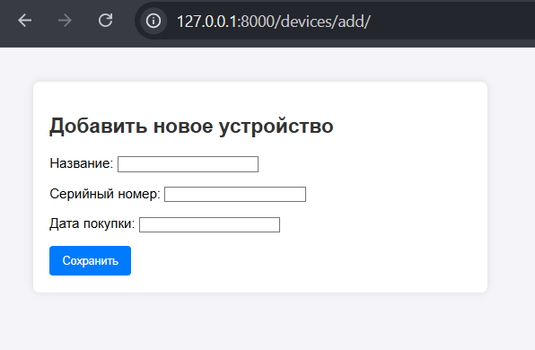

Проверка логики перенаправления (get_success_url):  Тест №1 (Текущий год): Укажите дату покупки, принадлежащую текущему году (например, 2026-05-10). Нажмите «Сохранить». Django должен перенаправить вас на общий список всех устройств. Если у вас ещё нет представления и URL для списка, Django выдаст ошибку NoReverseMatch или 404 на этот адрес — это нормально, главное, что он попытался уйти на нужный URL.  Тест №2 (Прошлые года): Снова зайдите на страницу добавления и создайте устройство, купленное раньше текущего года (например, в 2024). После сохранения Django должен перенаправить вас на страницу детального просмотра этого конкретного устройства.  Проверка в базе данных: Вы можете зайти в админку Django (http://127.0.0.1:8000/admin/), найти там раздел LaboratoryWork6 -> Devices и убедиться, что добавленные вами через форму тестовые устройства успешно сохранились в базу данных.


## Laboratory work 7 (13.05.2026)
<details>
    <summary>CLICK HERE TO SEE THE TASK CONDITION</summary>

> **Задание:**
> 1. 1 Настройка стандартной аутентификации
Задание 1.1. Настройка URL и шаблонов.
Подключите все стандартные маршруты аутентификации
(login, logout, password_change, password_reset) в urls.py вашего
проекта, используя django.contrib.auth.views.
Задание 1.2. Создание шаблонов.
Создайте в директории templates/registration/ следующие HTML-
шаблоны:

login.html (форма входа)

password_change_form.html (форма смены пароля)
Требования к login.html:

Форма должна отправлять данные методом POST.

Обязательно используйте .

Добавьте HTML-ссылку на страницу восстановления пароля.
Задание 1.3. Настройка редиректов.
В файле settings.py вашего проекта укажите значения для констант:

LOGIN_URL (куда отправлять неавторизованного пользователя).

LOGIN_REDIRECT_URL (куда отправлять пользователя после
успешного входа).
Задание 1.4. Навигация (контекстный вывод).
Напишите фрагмент HTML-шаблона (или кода внутри базового
шаблона), который проверяет, авторизован ли пользователь.

Если авторизован: вывести «Привет, {{ user.username }}» и
ссылку «Выйти».

Если нет: вывести ссылки «Войти» и «Зарегистрироваться».
2 Работа с моделью пользователя (Кастомизация)
> 2. Задание 2.1. Создание кастомной модели (Рекомендация).
Создайте свою модель пользователя CustomUser, унаследовав её
от AbstractUser. Добавьте в неё два новых поля:

date_of_birth (дата рождения, тип DateField, может быть
пустым).

phone_number (номер телефона, тип CharField, уникальный).
Важно: Укажите новую модель
в settings.py через AUTH_USER_MODEL. Внимание: это нужно
сделать до выполнения первой миграции.
Задание 2.2. Регистрация в админке.
Зарегистрируйте вашу модель CustomUser в файле admin.py.
Настройте CustomUserAdmin так, чтобы в админке отображались
поля username, email и добавленные
вами phone_number и date_of_birth.
Задание 2.3. Регистрация новых пользователей.
Используя CreateView, реализуйте страницу регистрации нового
пользователя.

URL: /signup/.

Шаблон должен содержать поля для заполнения имени, пароля
и email (и любых других полей, если вы их добавили).

После успешной регистрации автоматически выполняйте вход
пользователя и перенаправляйте его на главную страницу.
> 3. Восстановление пароля и Email
Задание 3.1. Настройка почтового бэкенда.
В целях отладки настройте в settings.py файловый бэкенд для
отправки писем. Укажите директорию sent_emails в корне проекта.
Убедитесь, что после попытки восстановления пароля в этой папке
появляется файл с письмом.
Задание 3.2. Проверка прав доступа.
Допустим, на медицинском сайте есть страница «Мои анализы» (URL: /my-results/).
Напишите декоратор или миксин для CBV (Class-Based View),
который запрещает доступ к этой странице анонимным пользователям.
Если неавторизованный пользователь попытается зайти, он должен
быть перенаправлен на страницу логина.
Задание 3.3. Логирование действий.
Напишите функцию (или код внутри представления), которая
отправляет письмо администратору через send_mail в следующих
случаях:
«Пользователь [username] сменил свой пароль».
Используйте консольный или файловый бэкенд для проверки.
</details>


